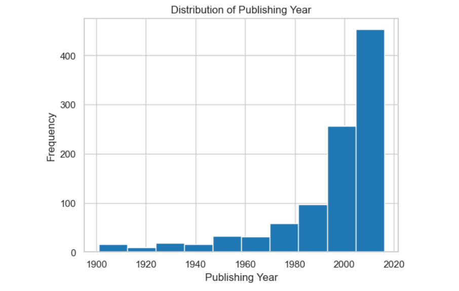
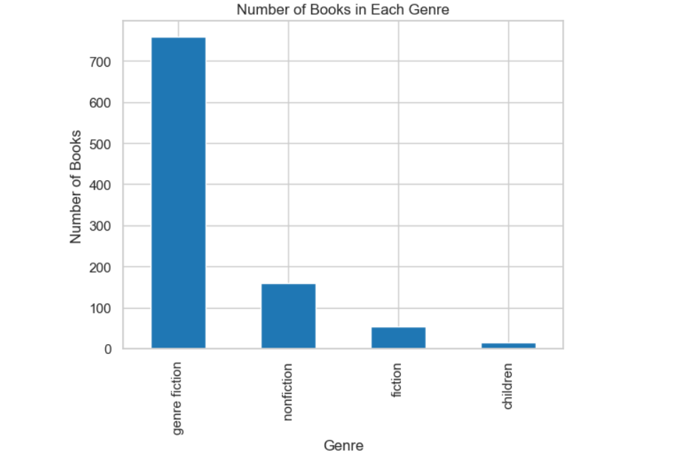
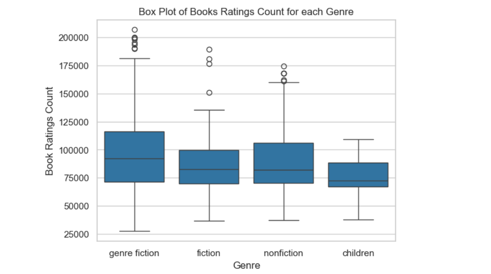
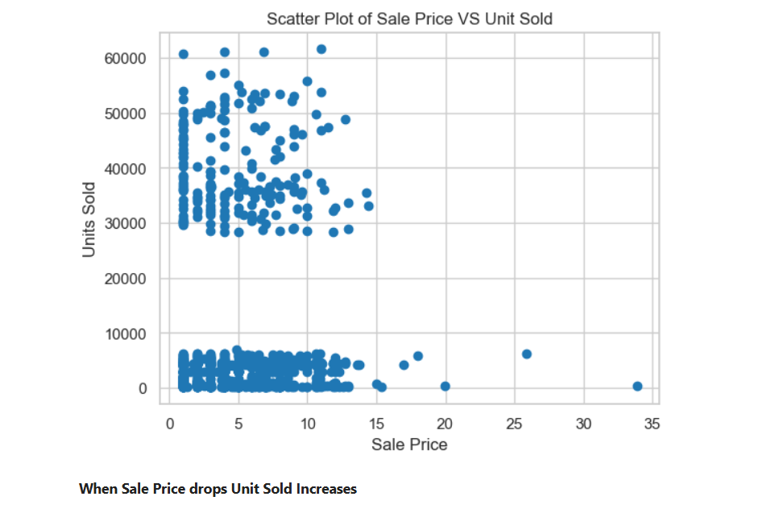
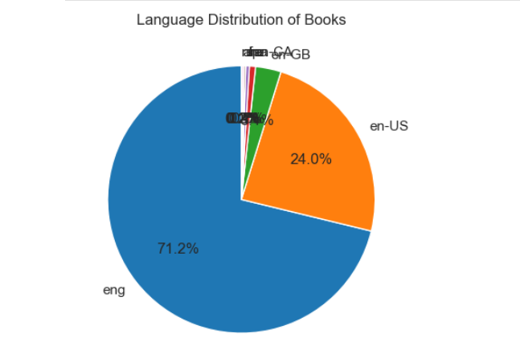
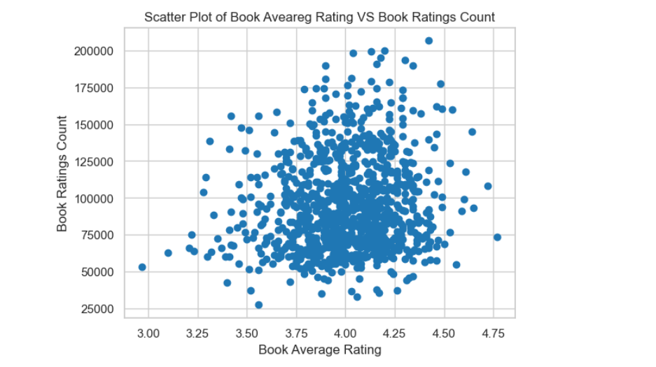
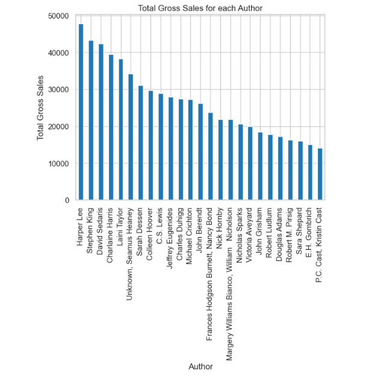
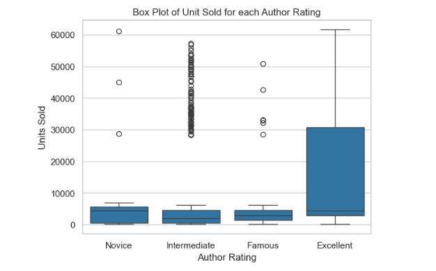

#  Books Sales and Ratings Analysis

##  Project Description

This project presents a comprehensive **Exploratory Data Analysis (EDA)** of a dataset containing information on book sales, ratings, genres, and authorship. Utilizing Python libraries like **Pandas**, **NumPy**, **Matplotlib**, and **Seaborn**, the goal is to uncover meaningful insights, trends, and patterns in book performance and reader preferences.

Through data cleaning, preprocessing, and compelling visualizations, we explore how factors like **genre**, **author**, **rating**, and **publication year** influence sales and popularity. This project also highlights top-performing authors and helps identify which characteristics define bestselling books.

This EDA serves as a foundational step for future applications such as **book recommendation systems**, **sales forecasting**, and **reader sentiment analysis**—demonstrating how data science can be used to understand publishing trends and consumer behavior.

---

##  Dataset

**Source:** [Kaggle - Books Sales and Ratings Dataset](https://www.kaggle.com/datasets/thedevastator/books-sales-and-ratings)

The dataset contains detailed features including:

- `Publishing Year` 
- `Book Name`   
- `Author`   
- `language_code`   
- `Author_Rating`   
- `Book_average_rating`   
- `Book_ratings_count`   
- `genre`   
- `gross sales`   
- `publisher revenue`   
- `sale price`   
- `sales rank`
- `Publisher`   
- `units sold` 


---

##  Technologies Used

- Python  
- Pandas, NumPy  
- Matplotlib, Seaborn  
- Jupyter Notebook  

---

##  Key Insights & Visualizations

This project explores and visualizes key aspects of the book market, including:

- Most popular **genres** based on frequency and sales  
- Top **authors** by average ratings and total books sold  
- Relationship between **ratings**, **reviews**, and **sales**  
- **Year-wise trends** in publication volume  
- Distribution of **book prices** and their impact on ratings  
- Genre-wise rating analysis and outliers  
- Most active publishers in the dataset

###  Visualizations are stored in the `screenshots/` folder.

---

### 🔹 Sample Visuals

  
*Distribution of books published by year*

  
*Number of books across each genre*

  
*Book ratings count across different genres*

  
*Relationship between sale price and units sold*

  
*Distribution of books by language*

  
*Relationship between book average rating and number of ratings*

  
*Total gross sales of each author*

  
*Units sold based on author rating*

  
*Total units sold from year to year*

---

##  How to Run

```bash
# Clone the repository
git clone https://github.com/AbdullahShariq/Books-EDA.git

# Navigate to the project directory
cd Books-EDA

# Launch the Jupyter Notebook
jupyter notebook "Books Sales and Ratings Analysis.ipynb"
```

---

## 📈 Summary of Insights

- Most books were published between **2000 and 2020**, marking a highly active era in publishing.  
- The **Fiction** genre leads in volume, showing strong reader preference for narrative content.  
- An **inverse relationship** exists between **sale price** and **units sold** — lower prices lead to more sales.  
- **English** is the most common language, reflecting its dominance in global publishing.  
- Most books have an **average rating around 4.0**, indicating generally positive reader feedback.  
- **Harper Lee** has the **highest total gross sales**, showing outstanding commercial success.  
- **Intermediate-rated authors** achieved the **most units sold**, likely due to broad market appeal.  

**Overall, this analysis reveals key insights into book trends, sales behavior, and reader preferences—offering a strong base for deeper analytics and recommendations.**
